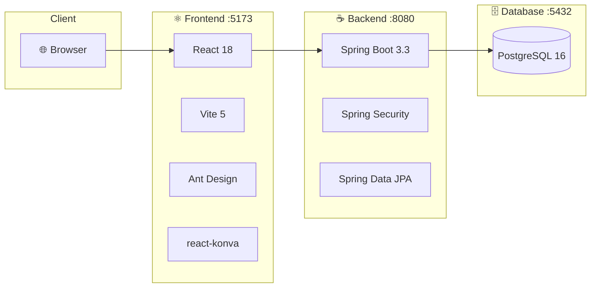

# 🏭 WMS - Warehouse Management System

> **Educational Example**: Modern full-stack application with Spring Boot + React

[](https://openjdk.org/)
[](https://spring.io/projects/spring-boot)
[](https://react.dev/)
[](https://www.typescriptlang.org/)
[](https://www.postgresql.org/)
[](https://www.docker.com/)

---

## 📋 About

WMS (Warehouse Management System) is an **educational project** designed to demonstrate best practices in modern full-stack development. It showcases a complete warehouse management solution with:

- 📦 **Product Management**: CRUD operations with categories and locations
- 🗺️ **Visual Warehouse Canvas**: Interactive 2D visualization using react-konva
- 🔐 **JWT Authentication**: Secure stateless authentication with Spring Security
- 🌍 **Internationalization**: Multi-language support (English/Spanish) with i18next
- 🐳 **Docker Development**: Containerized development environment

---

## 🖼️ Screenshots

*Coming soon*

---

## 🏗️ Architecture



---

## 🚀 Quick Start

### Prerequisites

- [Docker](https://www.docker.com/) & Docker Compose
- Git

### Run with Docker

```bash
# Clone the repository
git clone https://github.com/rafageist/wms.git
cd wms

# Start all services
docker-compose up --build

# Access the application
# Frontend: http://localhost:5173
# API: http://localhost:8080/api
```

### First Steps

1. Open http://localhost:5173
2. Click **Register** to create an account
3. Start adding categories, locations, and products
4. View your warehouse in the visual canvas

---

## 📁 Project Structure

```
wms/
├── 📂 api/                      # ☕ Spring Boot Backend
│   ├── src/main/java/com/rafageist/wms/
│   │   ├── config/             # Security configuration
│   │   ├── controller/         # REST endpoints
│   │   ├── dto/                # Request/Response DTOs
│   │   ├── model/              # JPA entities
│   │   ├── repository/         # Data access layer
│   │   ├── security/           # JWT authentication
│   │   └── WmsApplication.java
│   └── pom.xml
│
├── 📂 frontend/                 # ⚛️ React Frontend
│   ├── src/
│   │   ├── api/                # API client
│   │   ├── components/         # React components
│   │   ├── contexts/           # Auth context
│   │   ├── hooks/              # Custom hooks
│   │   ├── i18n/               # Translations
│   │   └── types/              # TypeScript types
│   └── package.json
│
├── 📂 docs/                     # 📚 Documentation
│   ├── README.md               # Documentation index
│   ├── architecture.md         # Technical architecture
│   ├── api.md                  # API reference
│   ├── database.md             # Database schema
│   ├── frontend.md             # Frontend architecture
│   ├── getting-started.md      # Setup guide
│   └── security.md             # Security documentation
│
├── docker-compose.yml           # 🐳 Docker orchestration
└── Dockerfile.dev               # Development container
```

---

## 🛠️ Technology Stack

### Backend

| Technology | Version | Purpose |
|------------|---------|---------|
| Java | 21 | Programming language |
| Spring Boot | 3.3.2 | Application framework |
| Spring Security | 6.x | Authentication & authorization |
| Spring Data JPA | 3.x | Database access |
| PostgreSQL | 16 | Relational database |
| JJWT | 0.12.6 | JWT token handling |
| Maven | 3.9+ | Build tool |

### Frontend

| Technology | Version | Purpose |
|------------|---------|---------|
| React | 18 | UI library |
| TypeScript | 5 | Type safety |
| Vite | 5 | Build tool & dev server |
| Ant Design | 5.22 | UI components |
| TanStack Query | 5 | Server state management |
| TanStack Table | 8 | Data tables |
| react-konva | 18.2.10 | 2D canvas visualization |
| i18next | 24 | Internationalization |
| Axios | 1.7 | HTTP client |

---

## 📚 Documentation

Comprehensive documentation is available in the [docs/](./docs/) folder:

| Document | Description |
|----------|-------------|
| [📖 Getting Started](./docs/getting-started.md) | Setup guide and first steps |
| [🏗️ Architecture](./docs/architecture.md) | System design and patterns |
| [🔌 API Reference](./docs/api.md) | REST endpoints documentation |
| [🗄️ Database](./docs/database.md) | Schema and entity relationships |
| [⚛️ Frontend](./docs/frontend.md) | React architecture guide |
| [🔐 Security](./docs/security.md) | JWT authentication details |

---

## 🎓 Educational Goals

This project demonstrates:

### Backend Concepts
- ✅ RESTful API design
- ✅ JWT authentication with Spring Security
- ✅ JPA/Hibernate entity relationships
- ✅ Repository pattern with Spring Data
- ✅ DTO pattern for API contracts
- ✅ UUID primary keys

### Frontend Concepts
- ✅ React functional components with hooks
- ✅ TypeScript for type safety
- ✅ Server state management with TanStack Query
- ✅ Form handling with Ant Design
- ✅ 2D canvas rendering with react-konva
- ✅ Internationalization with i18next

### DevOps Concepts
- ✅ Docker containerization
- ✅ Docker Compose for multi-service orchestration
- ✅ Hot-reload development environments

---

## 🧪 Development

### Backend Development

```bash
cd api
mvn spring-boot:run -Dspring-boot.run.profiles=dev
```

### Frontend Development

```bash
cd frontend
npm install
npm run dev
```

### Docker Development

```bash
# Start all services with hot-reload
docker-compose up

# Rebuild a specific service
docker-compose up --build api

# View logs
docker-compose logs -f api
```

---

## 📝 API Examples

### Register User

```bash
curl -X POST http://localhost:8080/api/auth/register \
  -H "Content-Type: application/json" \
  -d '{"username":"admin","password":"admin123","fullName":"Administrator"}'
```

### Login

```bash
curl -X POST http://localhost:8080/api/auth/login \
  -H "Content-Type: application/json" \
  -d '{"username":"admin","password":"admin123"}'
```

### Get Products (Authenticated)

```bash
curl http://localhost:8080/api/products \
  -H "Authorization: Bearer YOUR_JWT_TOKEN"
```

---

## 🤝 Contributing

Contributions are welcome! This is an educational project, so feel free to:

1. Fork the repository
2. Create a feature branch
3. Make your changes
4. Submit a pull request

---

## 📄 License

This project is open source and available under the [MIT License](LICENSE).

---

## 👤 Author

**Rafael Rodríguez** - [@rafageist](https://github.com/rafageist)

---

<p align="center">
  Made with ❤️ for educational purposes
</p>
