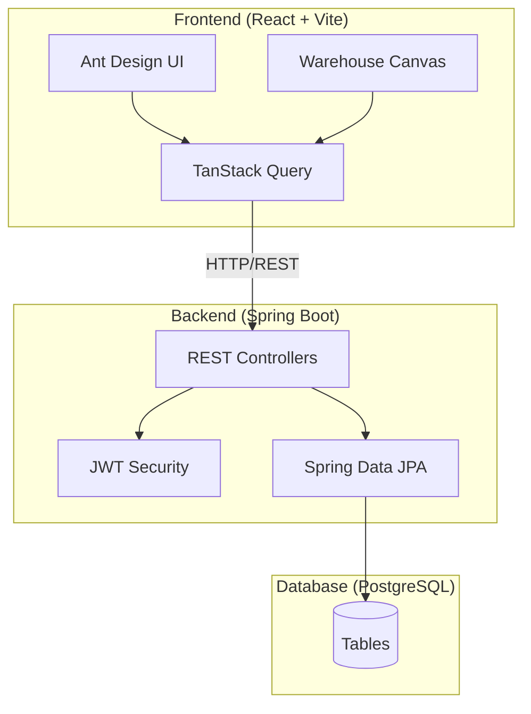

# 📚 WMS - Warehouse Management System Documentation

> **Educational Project**: Spring Boot + React for Warehouse Management

This documentation provides comprehensive technical information about the WMS (Warehouse Management System) project, an educational example demonstrating modern full-stack development practices.

## 📖 Documentation Index

| Document | Description |
|----------|-------------|
| [Architecture](./architecture.md) | System architecture, design patterns, and technical decisions |
| [Getting Started](./getting-started.md) | Setup guide for development environment |
| [API Reference](./api.md) | REST API endpoints documentation |
| [Database](./database.md) | Database schema and entity relationships |
| [Frontend](./frontend.md) | React frontend architecture and components |
| [Security](./security.md) | Authentication, authorization, and security features |

## 🎯 Project Overview

WMS is a warehouse management system designed as an **educational example** to demonstrate:

- **Backend**: Spring Boot 3.3 with Java 21
- **Frontend**: React 18 with TypeScript and Vite
- **Database**: PostgreSQL 16 with UUID primary keys
- **Authentication**: JWT-based stateless authentication
- **UI**: Ant Design 5.x component library
- **Visualization**: react-konva for 2D warehouse canvas

## 🏗️ Quick Architecture Overview



## 📁 Project Structure

```
wms/
├── api/                          # Spring Boot Backend
│   ├── src/main/java/com/rafageist/wms/
│   │   ├── config/              # Configuration classes
│   │   ├── controller/          # REST Controllers
│   │   ├── dto/                 # Data Transfer Objects
│   │   ├── model/               # JPA Entities
│   │   ├── repository/          # Spring Data Repositories
│   │   ├── security/            # JWT & Security
│   │   └── WmsApplication.java  # Main application
│   └── pom.xml
├── web/                          # React Frontend
│   ├── src/
│   │   ├── components/          # React Components
│   │   ├── hooks/               # Custom Hooks
│   │   ├── pages/               # Page Components
│   │   ├── i18n/                # Internationalization
│   │   └── types/               # TypeScript Types
│   └── package.json
├── docs/                         # Documentation
├── docker-compose.yml           # Docker orchestration
└── Dockerfile.dev               # Development Dockerfile
```

## 🚀 Quick Start

```bash
# Clone the repository
git clone https://github.com/rafageist/spring-react-example.git
cd spring-react-example

# Start with Docker Compose
docker-compose up -d

# Access the application
# Frontend: http://localhost:5173
# Backend API: http://localhost:8080
```

## 📜 License

This project is open source and available for educational purposes.

---

**Author**: Rafael Rodriguez ([@rafageist](https://github.com/rafageist))
