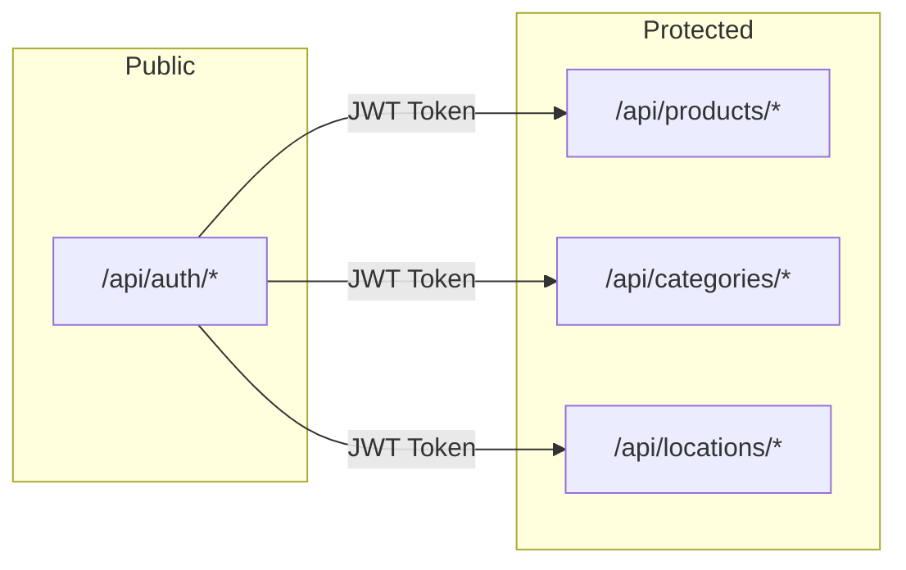
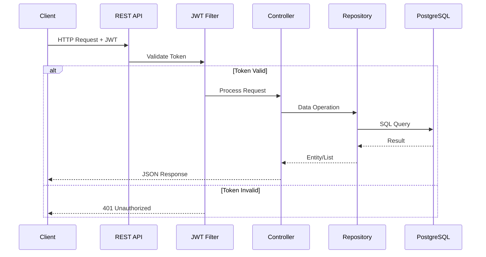

# 🔌 API Reference

> REST API documentation for WMS - Warehouse Management System

## Base URL

```
http://localhost:8080/api
```

## Authentication

All endpoints except `/api/auth/*` require JWT authentication.

### Headers

```http
Authorization: Bearer <JWT_TOKEN>
Content-Type: application/json
```

## Endpoints Overview



---

## 🔐 Authentication

### Register User

```http
POST /api/auth/register
```

**Request Body:**

```json
{
  "username": "johndoe",
  "password": "securepassword123",
  "fullName": "John Doe"
}
```

**Response (201 Created):**

```json
{
  "token": "eyJhbGciOiJIUzI1NiIsInR5cCI6IkpXVCJ9...",
  "username": "johndoe",
  "fullName": "John Doe"
}
```

### Login

```http
POST /api/auth/login
```

**Request Body:**

```json
{
  "username": "johndoe",
  "password": "securepassword123"
}
```

**Response (200 OK):**

```json
{
  "token": "eyJhbGciOiJIUzI1NiIsInR5cCI6IkpXVCJ9...",
  "username": "johndoe",
  "fullName": "John Doe"
}
```

---

## 📦 Products

### List Products

```http
GET /api/products
```

**Response (200 OK):**

```json
[
  {
    "id": "550e8400-e29b-41d4-a716-446655440000",
    "name": "Laptop HP Pavilion",
    "description": "15.6 inch laptop with Intel i7",
    "price": 899.99,
    "stock": 25,
    "imageUrl": "https://example.com/laptop.jpg",
    "posX": 150.0,
    "posY": 200.0,
    "category": {
      "id": "660e8400-e29b-41d4-a716-446655440001",
      "name": "Electronics",
      "color": "#1890ff"
    },
    "location": {
      "id": "770e8400-e29b-41d4-a716-446655440002",
      "name": "Zone A",
      "x": 100,
      "y": 100,
      "width": 200,
      "height": 150
    }
  }
]
```

### Get Product by ID

```http
GET /api/products/{id}
```

**Response (200 OK):**

```json
{
  "id": "550e8400-e29b-41d4-a716-446655440000",
  "name": "Laptop HP Pavilion",
  "description": "15.6 inch laptop with Intel i7",
  "price": 899.99,
  "stock": 25,
  "imageUrl": "https://example.com/laptop.jpg",
  "posX": 150.0,
  "posY": 200.0,
  "category": { ... },
  "location": { ... }
}
```

### Create Product

```http
POST /api/products
```

**Request Body:**

```json
{
  "name": "Laptop HP Pavilion",
  "description": "15.6 inch laptop with Intel i7",
  "price": 899.99,
  "stock": 25,
  "imageUrl": "https://example.com/laptop.jpg",
  "categoryId": "660e8400-e29b-41d4-a716-446655440001",
  "locationId": "770e8400-e29b-41d4-a716-446655440002"
}
```

**Response (201 Created):**

```json
{
  "id": "550e8400-e29b-41d4-a716-446655440000",
  "name": "Laptop HP Pavilion",
  ...
}
```

### Update Product

```http
PUT /api/products/{id}
```

**Request Body:**

```json
{
  "name": "Laptop HP Pavilion Pro",
  "price": 999.99,
  "stock": 20
}
```

**Response (200 OK):**

```json
{
  "id": "550e8400-e29b-41d4-a716-446655440000",
  "name": "Laptop HP Pavilion Pro",
  "price": 999.99,
  "stock": 20,
  ...
}
```

### Update Product Position

```http
PATCH /api/products/{id}/position
```

**Request Body:**

```json
{
  "posX": 250.0,
  "posY": 180.0,
  "locationId": "770e8400-e29b-41d4-a716-446655440002"
}
```

**Response (200 OK):**

```json
{
  "id": "550e8400-e29b-41d4-a716-446655440000",
  "posX": 250.0,
  "posY": 180.0,
  "location": { ... }
}
```

### Delete Product

```http
DELETE /api/products/{id}
```

**Response (204 No Content)**

### Bulk Delete Products

```http
DELETE /api/products
```

**Request Body:**

```json
["id1", "id2", "id3"]
```

**Response (204 No Content)**

---

## 📁 Categories

### List Categories

```http
GET /api/categories
```

**Response (200 OK):**

```json
[
  {
    "id": "660e8400-e29b-41d4-a716-446655440001",
    "name": "Electronics",
    "description": "Electronic devices and accessories",
    "color": "#1890ff"
  }
]
```

### Create Category

```http
POST /api/categories
```

**Request Body:**

```json
{
  "name": "Electronics",
  "description": "Electronic devices and accessories",
  "color": "#1890ff"
}
```

**Response (201 Created):**

```json
{
  "id": "660e8400-e29b-41d4-a716-446655440001",
  "name": "Electronics",
  "description": "Electronic devices and accessories",
  "color": "#1890ff"
}
```

### Update Category

```http
PUT /api/categories/{id}
```

### Delete Category

```http
DELETE /api/categories/{id}
```

---

## 📍 Locations

### List Locations

```http
GET /api/locations
```

**Response (200 OK):**

```json
[
  {
    "id": "770e8400-e29b-41d4-a716-446655440002",
    "name": "Zone A - Electronics",
    "description": "Storage zone for electronic products",
    "x": 100,
    "y": 100,
    "width": 200,
    "height": 150,
    "capacity": 50,
    "color": "#e6f7ff",
    "borderColor": "#1890ff"
  }
]
```

### Create Location

```http
POST /api/locations
```

**Request Body:**

```json
{
  "name": "Zone A - Electronics",
  "description": "Storage zone for electronic products",
  "x": 100,
  "y": 100,
  "width": 200,
  "height": 150,
  "capacity": 50,
  "color": "#e6f7ff",
  "borderColor": "#1890ff"
}
```

**Response (201 Created):**

```json
{
  "id": "770e8400-e29b-41d4-a716-446655440002",
  "name": "Zone A - Electronics",
  ...
}
```

### Update Location (Partial)

```http
PATCH /api/locations/{id}
```

**Request Body (only fields to update):**

```json
{
  "x": 150,
  "y": 120,
  "width": 250
}
```

**Response (200 OK):**

```json
{
  "id": "770e8400-e29b-41d4-a716-446655440002",
  "x": 150,
  "y": 120,
  "width": 250,
  ...
}
```

### Delete Location

```http
DELETE /api/locations/{id}
```

**Response (204 No Content)**

---

## Error Responses

### 400 Bad Request

```json
{
  "timestamp": "2026-03-01T12:00:00Z",
  "status": 400,
  "error": "Bad Request",
  "message": "Validation failed",
  "path": "/api/products"
}
```

### 401 Unauthorized

```json
{
  "timestamp": "2026-03-01T12:00:00Z",
  "status": 401,
  "error": "Unauthorized",
  "message": "Invalid or expired token",
  "path": "/api/products"
}
```

### 404 Not Found

```json
{
  "timestamp": "2026-03-01T12:00:00Z",
  "status": 404,
  "error": "Not Found",
  "message": "Product not found",
  "path": "/api/products/invalid-id"
}
```

### 500 Internal Server Error

```json
{
  "timestamp": "2026-03-01T12:00:00Z",
  "status": 500,
  "error": "Internal Server Error",
  "message": "An unexpected error occurred",
  "path": "/api/products"
}
```

---

## Request Flow



---

[← Back to Documentation Index](./README.md)
