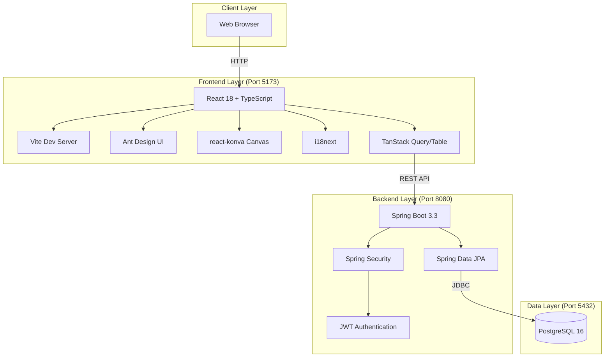
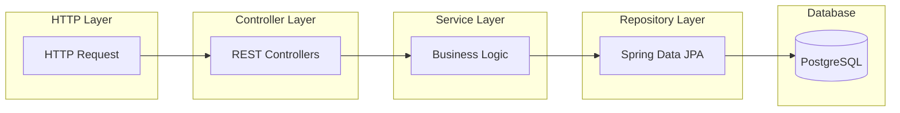
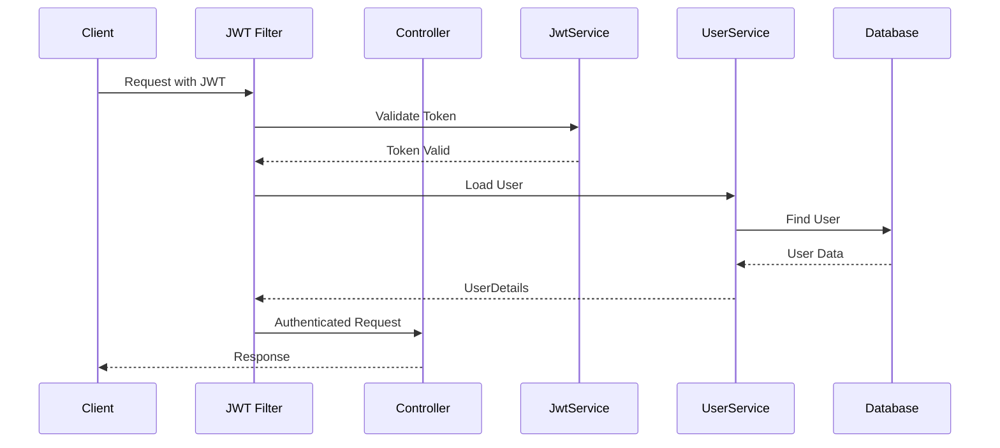
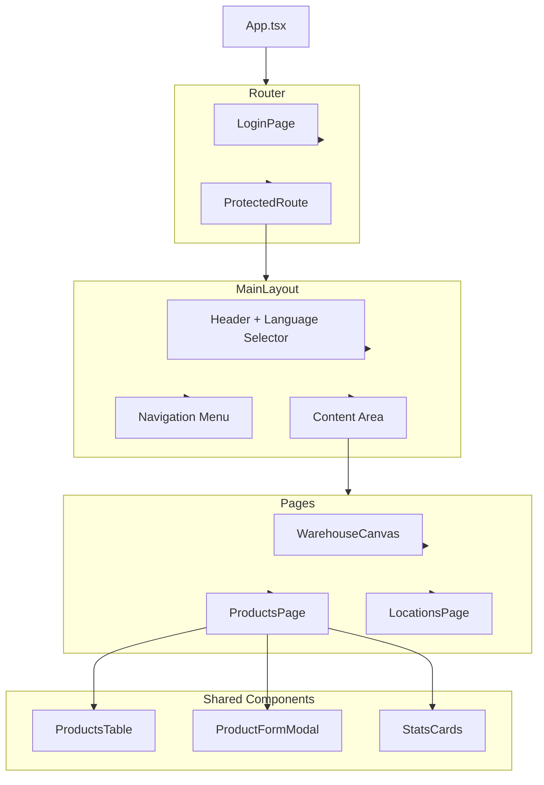
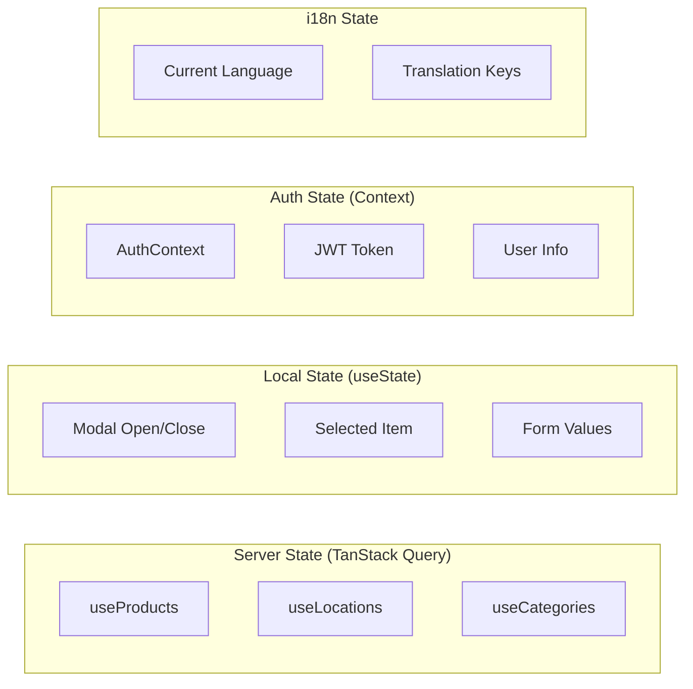
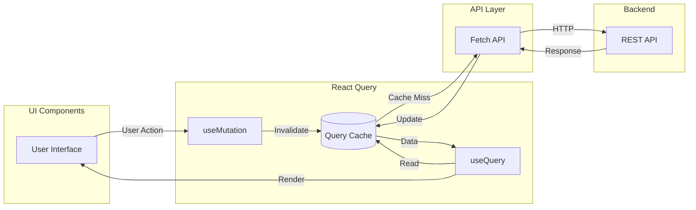
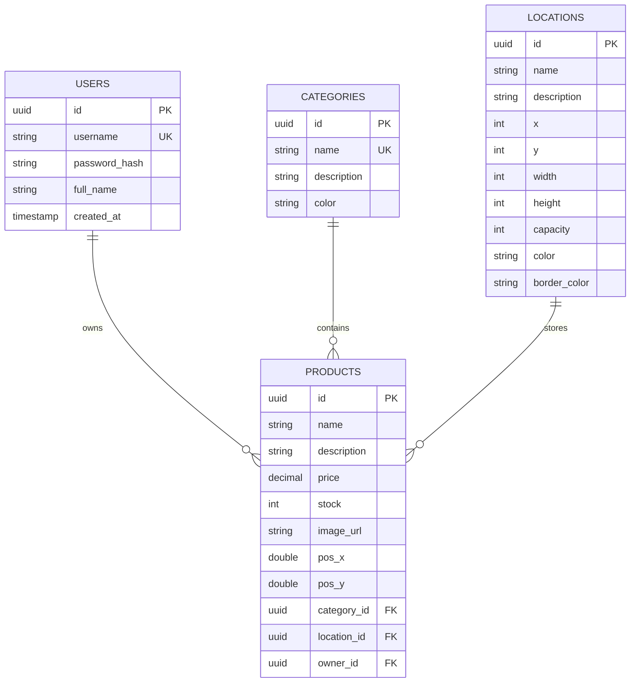
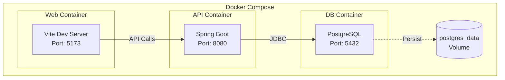

# 🏗️ System Architecture

> Technical architecture documentation for WMS - Warehouse Management System

## Overview

WMS follows a modern **three-tier architecture** with clear separation of concerns:

1. **Presentation Layer** - React SPA with TypeScript
2. **Business Logic Layer** - Spring Boot REST API
3. **Data Layer** - PostgreSQL Database

## High-Level Architecture



## Backend Architecture

### Package Structure

```
com.rafageist.wms
├── WmsApplication.java          # Application entry point
├── config/
│   └── SecurityConfig.java      # Security configuration
├── controller/
│   ├── AuthController.java      # Authentication endpoints
│   ├── CategoryController.java  # Category CRUD
│   ├── LocationController.java  # Location CRUD  
│   └── ProductController.java   # Product CRUD
├── dto/
│   ├── AuthResponse.java        # JWT response DTO
│   ├── LoginRequest.java        # Login request DTO
│   └── RegisterRequest.java     # Registration DTO
├── model/
│   ├── Category.java            # Category entity
│   ├── Location.java            # Warehouse location entity
│   ├── Product.java             # Product entity
│   └── User.java                # User entity
├── repository/
│   ├── CategoryRepository.java  # Category data access
│   ├── LocationRepository.java  # Location data access
│   ├── ProductRepository.java   # Product data access
│   └── UserRepository.java      # User data access
└── security/
    ├── CustomUserDetailsService.java  # User details service
    ├── JwtAuthenticationFilter.java   # JWT filter
    └── JwtService.java                # JWT operations
```

### Layered Architecture Pattern



### Security Flow



## Frontend Architecture

### Component Hierarchy



### State Management



### Data Flow



## Database Architecture

### Entity Relationship Diagram



## Design Patterns Used

### Backend Patterns

| Pattern | Usage |
|---------|-------|
| **Repository Pattern** | Spring Data JPA repositories abstract data access |
| **DTO Pattern** | Separate request/response objects from entities |
| **Filter Chain** | JWT authentication via security filter |
| **Dependency Injection** | Spring IoC container manages all beans |
| **Builder Pattern** | JWT token construction |

### Frontend Patterns

| Pattern | Usage |
|---------|-------|
| **Component Pattern** | Reusable UI components |
| **Custom Hooks** | Encapsulate stateful logic (useProducts, useAuth) |
| **Render Props** | TanStack Table column definitions |
| **Provider Pattern** | Auth context, i18n provider |
| **Composition** | Complex UIs from simple components |

## Technology Stack Summary

### Backend

| Technology | Version | Purpose |
|------------|---------|---------|
| Java | 21 | Language runtime |
| Spring Boot | 3.3.2 | Application framework |
| Spring Security | 6.x | Authentication/Authorization |
| Spring Data JPA | 3.x | ORM and data access |
| PostgreSQL | 16 | Relational database |
| JJWT | 0.12.6 | JWT library |

### Frontend

| Technology | Version | Purpose |
|------------|---------|---------|
| React | 18.x | UI library |
| TypeScript | 5.x | Type safety |
| Vite | 5.x | Build tool |
| Ant Design | 5.22 | UI component library |
| TanStack Query | 5.x | Server state management |
| TanStack Table | 8.x | Data tables |
| react-konva | 18.x | 2D canvas rendering |
| i18next | 23.x | Internationalization |

### Infrastructure

| Technology | Purpose |
|------------|---------|
| Docker | Containerization |
| Docker Compose | Multi-container orchestration |

## Deployment Architecture



---

[← Back to Documentation Index](./README.md)
