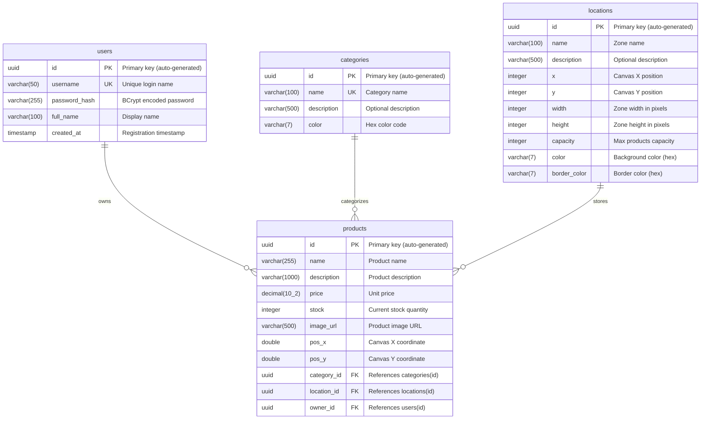
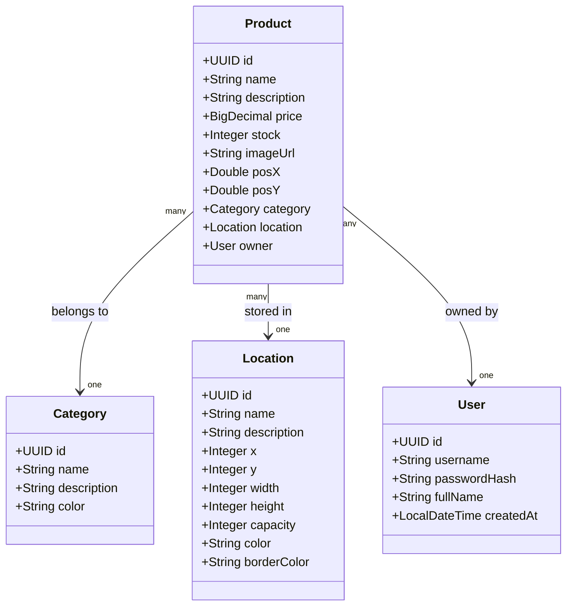

# 🗄️ Database Documentation

> Database schema and entity documentation for WMS

## Overview

WMS uses **PostgreSQL 16** as its relational database. The schema uses **UUID** as primary keys for all tables, providing better distribution and security.

## Database Connection

```properties
# Development Configuration
spring.datasource.url=jdbc:postgresql://db:5432/wms_db
spring.datasource.username=postgres
spring.datasource.password=postgres
```

## Entity Relationship Diagram



---

## Tables Detail

### users

Stores user authentication and profile information.

| Column | Type | Constraints | Description |
|--------|------|-------------|-------------|
| `id` | `UUID` | PK, NOT NULL | Auto-generated UUID |
| `username` | `VARCHAR(50)` | UNIQUE, NOT NULL | Login username |
| `password_hash` | `VARCHAR(255)` | NOT NULL | BCrypt hashed password |
| `full_name` | `VARCHAR(100)` | NOT NULL | User's display name |
| `created_at` | `TIMESTAMP` | NOT NULL, DEFAULT NOW() | Account creation time |

**Indexes:**
- `pk_users` - Primary key on `id`
- `uk_users_username` - Unique index on `username`

---

### categories

Defines product categories for organization.

| Column | Type | Constraints | Description |
|--------|------|-------------|-------------|
| `id` | `UUID` | PK, NOT NULL | Auto-generated UUID |
| `name` | `VARCHAR(100)` | UNIQUE, NOT NULL | Category name |
| `description` | `VARCHAR(500)` | NULL | Optional description |
| `color` | `VARCHAR(7)` | NOT NULL, DEFAULT '#1890ff' | Hex color for UI |

**Indexes:**
- `pk_categories` - Primary key on `id`
- `uk_categories_name` - Unique index on `name`

---

### locations

Represents warehouse zones visualized on the canvas.

| Column | Type | Constraints | Description |
|--------|------|-------------|-------------|
| `id` | `UUID` | PK, NOT NULL | Auto-generated UUID |
| `name` | `VARCHAR(100)` | NOT NULL | Zone display name |
| `description` | `VARCHAR(500)` | NULL | Optional description |
| `x` | `INTEGER` | NOT NULL | X position in pixels |
| `y` | `INTEGER` | NOT NULL | Y position in pixels |
| `width` | `INTEGER` | NOT NULL | Zone width in pixels |
| `height` | `INTEGER` | NOT NULL | Zone height in pixels |
| `capacity` | `INTEGER` | NOT NULL | Max product capacity |
| `color` | `VARCHAR(7)` | NOT NULL | Background color (hex) |
| `border_color` | `VARCHAR(7)` | NOT NULL | Border color (hex) |

**Indexes:**
- `pk_locations` - Primary key on `id`

---

### products

Core table storing product inventory data.

| Column | Type | Constraints | Description |
|--------|------|-------------|-------------|
| `id` | `UUID` | PK, NOT NULL | Auto-generated UUID |
| `name` | `VARCHAR(255)` | NOT NULL | Product name |
| `description` | `VARCHAR(1000)` | NULL | Product description |
| `price` | `DECIMAL(10,2)` | NOT NULL | Unit price |
| `stock` | `INTEGER` | NOT NULL | Current stock quantity |
| `image_url` | `VARCHAR(500)` | NULL | Product image URL |
| `pos_x` | `DOUBLE` | NULL | X position on canvas |
| `pos_y` | `DOUBLE` | NULL | Y position on canvas |
| `category_id` | `UUID` | FK → categories(id) | Product category |
| `location_id` | `UUID` | FK → locations(id) | Warehouse location |
| `owner_id` | `UUID` | FK → users(id) | Product owner |

**Indexes:**
- `pk_products` - Primary key on `id`
- `idx_products_category` - Index on `category_id`
- `idx_products_location` - Index on `location_id`
- `idx_products_owner` - Index on `owner_id`

**Foreign Keys:**
- `fk_products_category` → `categories(id)` ON DELETE SET NULL
- `fk_products_location` → `locations(id)` ON DELETE SET NULL
- `fk_products_owner` → `users(id)` ON DELETE CASCADE

---

## JPA Entities Mapping

### Entity Relationships



### Fetch Strategies

| Relationship | Type | Fetch Strategy | Reason |
|--------------|------|----------------|--------|
| Product → Category | ManyToOne | EAGER | Categories are small, always needed |
| Product → Location | ManyToOne | EAGER | Location info needed for canvas |
| Product → User | ManyToOne | EAGER | Owner info for multi-tenant |

---

## Database Initialization

### PostgreSQL UUID Extension

The database requires the `uuid-ossp` extension for UUID generation:

```sql
CREATE EXTENSION IF NOT EXISTS "uuid-ossp";
```

### DDL Auto Configuration

For development, JPA auto-generates the schema:

```properties
spring.jpa.hibernate.ddl-auto=update
```

**DDL Modes:**
- `create` - Drop and create schema on startup
- `create-drop` - Create on startup, drop on shutdown
- `update` - Update schema without data loss
- `validate` - Validate schema, no changes
- `none` - No schema management

---

## Sample SQL Queries

### Get all products with relations

```sql
SELECT 
    p.id,
    p.name,
    p.price,
    p.stock,
    c.name as category_name,
    l.name as location_name
FROM products p
LEFT JOIN categories c ON p.category_id = c.id
LEFT JOIN locations l ON p.location_id = l.id
ORDER BY p.name;
```

### Get low stock products

```sql
SELECT * FROM products
WHERE stock < 20
ORDER BY stock ASC;
```

### Get products by location

```sql
SELECT * FROM products
WHERE location_id = 'uuid-here'
ORDER BY pos_y, pos_x;
```

### Calculate inventory value

```sql
SELECT 
    SUM(price * stock) as total_value,
    COUNT(*) as total_products,
    SUM(stock) as total_units
FROM products;
```

---

## Docker Volume

Product data is persisted in a Docker volume:

```yaml
volumes:
  postgres_data:
    driver: local
```

**Location:** `postgres_data:/var/lib/postgresql/data`

---

[← Back to Documentation Index](./README.md)
