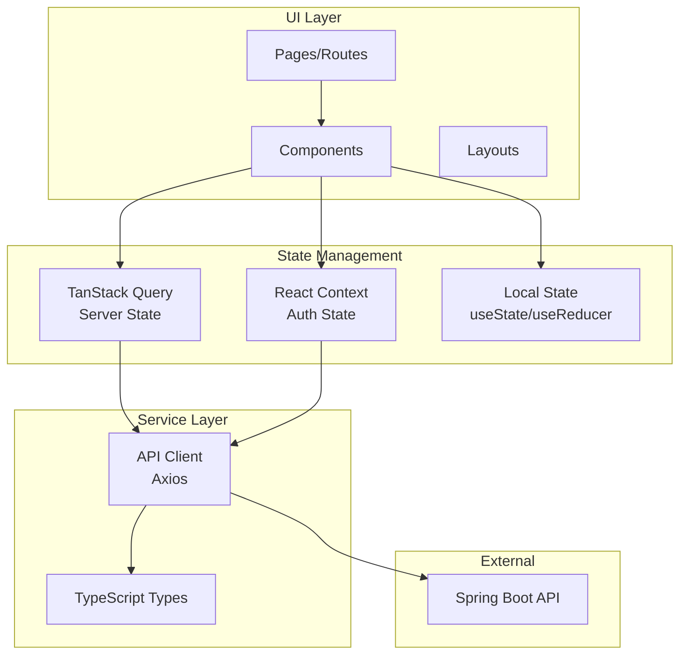
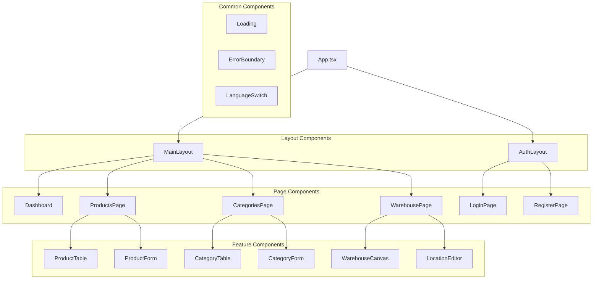
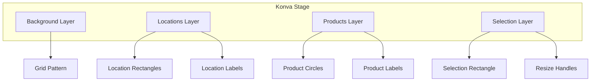

# ⚛️ Frontend Documentation

> React frontend architecture and development guide

## Overview

The WMS frontend is a modern **Single Page Application (SPA)** built with:

| Technology | Version | Purpose |
|------------|---------|---------|
| React | 18 | UI library |
| TypeScript | 5 | Type safety |
| Vite | 5 | Build tool & dev server |
| Ant Design | 5.22 | UI component library |
| TanStack Query | 5 | Server state management |
| TanStack Table | 8 | Data tables |
| react-konva | 18.2.10 | 2D canvas rendering |
| i18next | 24 | Internationalization |
| Axios | 1.7 | HTTP client |

---

## Architecture



---

## Folder Structure

```
frontend/src/
├── api/                    # API client and endpoints
│   ├── client.ts           # Axios instance configuration
│   ├── products.ts         # Product API functions
│   ├── categories.ts       # Category API functions
│   └── locations.ts        # Location API functions
│
├── components/             # React components
│   ├── auth/               # Login, Register forms
│   ├── products/           # Product table, forms
│   ├── categories/         # Category management
│   ├── locations/          # Location management
│   ├── warehouse/          # Canvas visualization
│   └── common/             # Shared components
│
├── contexts/               # React contexts
│   └── AuthContext.tsx     # Authentication state
│
├── hooks/                  # Custom React hooks
│   ├── useProducts.ts      # Product queries/mutations
│   ├── useCategories.ts    # Category queries/mutations
│   └── useLocations.ts     # Location queries/mutations
│
├── i18n/                   # Internationalization
│   ├── index.ts            # i18next configuration
│   └── locales/
│       ├── en.json         # English translations
│       └── es.json         # Spanish translations
│
├── types/                  # TypeScript type definitions
│   ├── Product.ts
│   ├── Category.ts
│   ├── Location.ts
│   └── User.ts
│
├── App.tsx                 # Root component with routing
├── main.tsx                # Application entry point
└── vite-env.d.ts           # Vite type definitions
```

---

## Component Architecture

### Component Hierarchy



---

## State Management

### TanStack Query (Server State)

Used for all API data fetching and caching:

```typescript
// Query example
const { data, isLoading, error } = useQuery({
    queryKey: ['products'],
    queryFn: fetchProducts
});

// Mutation example
const mutation = useMutation({
    mutationFn: createProduct,
    onSuccess: () => {
        queryClient.invalidateQueries({ queryKey: ['products'] });
    }
});
```

### Query Keys Convention

| Entity | Query Key |
|--------|-----------|
| All products | `['products']` |
| Single product | `['products', id]` |
| All categories | `['categories']` |
| All locations | `['locations']` |

### React Context (Auth State)

```typescript
interface AuthContextType {
    user: User | null;
    token: string | null;
    login: (credentials: LoginRequest) => Promise<void>;
    register: (data: RegisterRequest) => Promise<void>;
    logout: () => void;
    isAuthenticated: boolean;
}

// Usage
const { user, login, logout, isAuthenticated } = useAuth();
```

---

## API Client

### Configuration

```typescript
// api/client.ts
import axios from 'axios';

const api = axios.create({
    baseURL: import.meta.env.VITE_API_URL || '/api',
    headers: {
        'Content-Type': 'application/json'
    }
});

// Add auth token to requests
api.interceptors.request.use((config) => {
    const token = localStorage.getItem('token');
    if (token) {
        config.headers.Authorization = `Bearer ${token}`;
    }
    return config;
});

export default api;
```

### API Functions Pattern

```typescript
// api/products.ts
import api from './client';
import { Product, CreateProductDto, UpdateProductDto } from '../types';

export const fetchProducts = async (): Promise<Product[]> => {
    const { data } = await api.get('/products');
    return data;
};

export const createProduct = async (product: CreateProductDto): Promise<Product> => {
    const { data } = await api.post('/products', product);
    return data;
};

export const updateProduct = async (id: string, product: UpdateProductDto): Promise<Product> => {
    const { data } = await api.put(`/products/${id}`, product);
    return data;
};

export const deleteProduct = async (id: string): Promise<void> => {
    await api.delete(`/products/${id}`);
};
```

---

## Custom Hooks

### useProducts Hook

```typescript
export const useProducts = () => {
    const queryClient = useQueryClient();
    
    const query = useQuery({
        queryKey: ['products'],
        queryFn: fetchProducts
    });
    
    const createMutation = useMutation({
        mutationFn: createProduct,
        onSuccess: () => {
            queryClient.invalidateQueries({ queryKey: ['products'] });
        }
    });
    
    const updateMutation = useMutation({
        mutationFn: ({ id, data }: { id: string; data: UpdateProductDto }) =>
            updateProduct(id, data),
        onSuccess: () => {
            queryClient.invalidateQueries({ queryKey: ['products'] });
        }
    });
    
    const deleteMutation = useMutation({
        mutationFn: deleteProduct,
        onSuccess: () => {
            queryClient.invalidateQueries({ queryKey: ['products'] });
        }
    });
    
    return {
        products: query.data ?? [],
        isLoading: query.isLoading,
        error: query.error,
        createProduct: createMutation.mutate,
        updateProduct: updateMutation.mutate,
        deleteProduct: deleteMutation.mutate
    };
};
```

---

## Internationalization (i18n)

### Configuration

```typescript
// i18n/index.ts
import i18n from 'i18next';
import { initReactI18next } from 'react-i18next';
import en from './locales/en.json';
import es from './locales/es.json';

i18n.use(initReactI18next).init({
    resources: {
        en: { translation: en },
        es: { translation: es }
    },
    lng: 'en',              // Default language
    fallbackLng: 'en',
    interpolation: {
        escapeValue: false
    }
});

export default i18n;
```

### Translation Files Structure

```json
// locales/en.json
{
    "common": {
        "save": "Save",
        "cancel": "Cancel",
        "delete": "Delete",
        "edit": "Edit",
        "loading": "Loading..."
    },
    "products": {
        "title": "Products",
        "name": "Name",
        "price": "Price",
        "stock": "Stock",
        "addProduct": "Add Product"
    },
    "auth": {
        "login": "Login",
        "register": "Register",
        "username": "Username",
        "password": "Password"
    }
}
```

### Usage in Components

```tsx
import { useTranslation } from 'react-i18next';

const ProductsPage = () => {
    const { t } = useTranslation();
    
    return (
        <div>
            <h1>{t('products.title')}</h1>
            <Button>{t('products.addProduct')}</Button>
        </div>
    );
};
```

### Language Switcher

```tsx
const LanguageSwitch = () => {
    const { i18n } = useTranslation();
    
    return (
        <Select
            value={i18n.language}
            onChange={(value) => i18n.changeLanguage(value)}
        >
            <Select.Option value="en">English</Select.Option>
            <Select.Option value="es">Español</Select.Option>
        </Select>
    );
};
```

---

## Warehouse Canvas (react-konva)

### Canvas Architecture



### WarehouseCanvas Component

```tsx
import { Stage, Layer, Rect, Circle, Text, Transformer } from 'react-konva';

const WarehouseCanvas = () => {
    const { locations } = useLocations();
    const { products } = useProducts();
    
    return (
        <Stage width={1200} height={800}>
            {/* Background Layer */}
            <Layer>
                <Rect fill="#f0f0f0" width={1200} height={800} />
            </Layer>
            
            {/* Locations Layer */}
            <Layer>
                {locations.map((location) => (
                    <LocationShape 
                        key={location.id}
                        location={location}
                        onDragEnd={handleLocationMove}
                    />
                ))}
            </Layer>
            
            {/* Products Layer */}
            <Layer>
                {products.map((product) => (
                    <ProductMarker
                        key={product.id}
                        product={product}
                        onDragEnd={handleProductMove}
                    />
                ))}
            </Layer>
        </Stage>
    );
};
```

---

## TypeScript Types

### Product Type

```typescript
export interface Product {
    id: string;
    name: string;
    description?: string;
    price: number;
    stock: number;
    imageUrl?: string;
    posX?: number;
    posY?: number;
    category?: Category;
    location?: Location;
}

export interface CreateProductDto {
    name: string;
    description?: string;
    price: number;
    stock: number;
    imageUrl?: string;
    categoryId?: string;
    locationId?: string;
}

export interface UpdateProductDto extends Partial<CreateProductDto> {}
```

### Category Type

```typescript
export interface Category {
    id: string;
    name: string;
    description?: string;
    color: string;
}
```

### Location Type

```typescript
export interface Location {
    id: string;
    name: string;
    description?: string;
    x: number;
    y: number;
    width: number;
    height: number;
    capacity: number;
    color: string;
    borderColor: string;
}
```

---

## Ant Design Theming

### Custom Theme

```typescript
// main.tsx
import { ConfigProvider } from 'antd';

const theme = {
    token: {
        colorPrimary: '#1890ff',
        borderRadius: 6,
        fontFamily: 'Inter, sans-serif'
    }
};

<ConfigProvider theme={theme}>
    <App />
</ConfigProvider>
```

### Common Components Used

| Component | Usage |
|-----------|-------|
| `Table` | Data tables with sorting, pagination |
| `Form` | Input forms with validation |
| `Modal` | Dialogs for create/edit |
| `Button` | Actions and navigation |
| `Select` | Category/location selection |
| `Input` | Text inputs |
| `InputNumber` | Numeric inputs (price, stock) |
| `Card` | Content containers |
| `Layout` | Page structure |
| `Menu` | Navigation |
| `message` | Toast notifications |

---

## Build & Deployment

### Development

```bash
npm run dev
# Starts Vite dev server at localhost:5173
```

### Production Build

```bash
npm run build
# Creates optimized bundle in dist/
```

### Build Output

```
dist/
├── index.html
├── assets/
│   ├── index-[hash].js      # Main bundle
│   ├── index-[hash].css     # Styles
│   └── vendor-[hash].js     # Dependencies
```

---

## Testing

### Recommended Tools

| Tool | Purpose |
|------|---------|
| Vitest | Unit testing |
| React Testing Library | Component testing |
| MSW (Mock Service Worker) | API mocking |
| Playwright | E2E testing |

### Example Test

```typescript
import { render, screen } from '@testing-library/react';
import { ProductTable } from './ProductTable';

describe('ProductTable', () => {
    it('renders products', async () => {
        render(<ProductTable products={mockProducts} />);
        
        expect(screen.getByText('Test Product')).toBeInTheDocument();
    });
});
```

---

[← Back to Documentation Index](./README.md)
