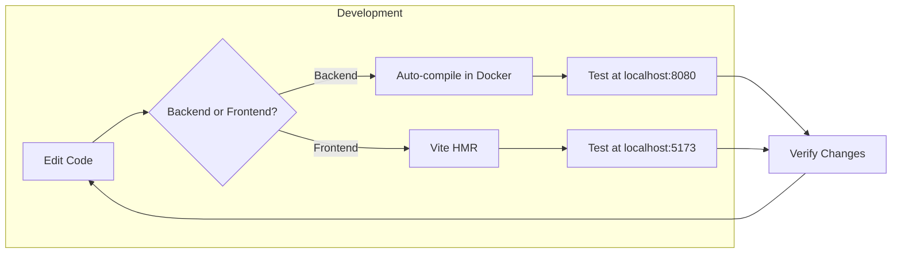

# 🚀 Getting Started

> Step-by-step guide to set up and run the WMS project

## Prerequisites

Before you begin, ensure you have the following installed:

| Tool | Version | Purpose |
|------|---------|---------|
| **Docker** | 20.10+ | Container runtime |
| **Docker Compose** | 2.0+ | Multi-container orchestration |
| **Git** | 2.0+ | Version control |

Optional (for local development without Docker):

| Tool | Version | Purpose |
|------|---------|---------|
| **JDK** | 21+ | Java runtime |
| **Maven** | 3.9+ | Java build tool |
| **Node.js** | 20+ | JavaScript runtime |
| **npm** | 10+ | Package manager |
| **PostgreSQL** | 16+ | Database |

---

## Quick Start with Docker

### 1. Clone the Repository

```bash
git clone https://github.com/your-repo/wms.git
cd wms
```

### 2. Start All Services

```bash
docker-compose up --build
```

This will start:
- 🗄️ **PostgreSQL** on port `5432`
- ☕ **Spring Boot API** on port `8080`
- ⚛️ **React Frontend** on port `5173`

### 3. Access the Application

| Service | URL |
|---------|-----|
| Frontend | http://localhost:5173 |
| API | http://localhost:8080/api |
| API Docs | http://localhost:8080/api/hello |

### 4. Default Credentials

The application starts with no users. Register a new account:

1. Go to http://localhost:5173
2. Click "Register"
3. Fill in your details

---

## Project Structure

```
wms/
├── api/                          # Spring Boot Backend
│   ├── src/
│   │   └── main/
│   │       ├── java/
│   │       │   └── com/rafageist/wms/
│   │       │       ├── config/        # Security config
│   │       │       ├── controller/    # REST endpoints
│   │       │       ├── dto/           # Request/Response objects
│   │       │       ├── model/         # JPA entities
│   │       │       ├── repository/    # Data access
│   │       │       └── security/      # JWT & auth
│   │       └── resources/
│   │           └── application-dev.properties
│   └── pom.xml
│
├── frontend/                     # React Frontend
│   ├── src/
│   │   ├── api/                 # API client
│   │   ├── components/          # React components
│   │   ├── contexts/            # React contexts
│   │   ├── hooks/               # Custom hooks
│   │   ├── i18n/                # Internationalization
│   │   └── types/               # TypeScript types
│   ├── package.json
│   └── vite.config.ts
│
├── docs/                         # Documentation
├── docker-compose.yml            # Docker orchestration
└── Dockerfile.dev                # Dev container config
```

---

## Development Setup

### Backend Development

#### Option A: Using Docker (Recommended)

The API container has hot-reload enabled. Edit files and they auto-compile.

```bash
# Start only backend services
docker-compose up db api
```

#### Option B: Local Maven

```bash
cd api

# Install dependencies
mvn clean install

# Run with dev profile
mvn spring-boot:run -Dspring-boot.run.profiles=dev
```

**Note:** Configure `application-dev.properties` with local PostgreSQL credentials.

---

### Frontend Development

#### Option A: Using Docker

Frontend uses Vite with HMR (Hot Module Replacement).

```bash
docker-compose up frontend
```

#### Option B: Local npm

```bash
cd frontend

# Install dependencies
npm install

# Start dev server
npm run dev
```

---

## Environment Configuration

### Backend Environment Variables

| Variable | Default | Description |
|----------|---------|-------------|
| `SPRING_PROFILES_ACTIVE` | `dev` | Active Spring profile |
| `SPRING_DATASOURCE_URL` | `jdbc:postgresql://db:5432/wms_db` | Database URL |
| `SPRING_DATASOURCE_USERNAME` | `postgres` | Database user |
| `SPRING_DATASOURCE_PASSWORD` | `postgres` | Database password |
| `JWT_SECRET` | Generated | Secret for JWT signing |

### Frontend Environment Variables

Create `.env` file in `frontend/`:

```env
VITE_API_URL=http://localhost:8080/api
```

---

## Development Workflow



---

## Common Commands

### Docker Commands

```bash
# Start all services
docker-compose up

# Start with rebuild
docker-compose up --build

# Start in background
docker-compose up -d

# Stop all services
docker-compose down

# View logs
docker-compose logs -f api

# Restart a service
docker-compose restart api

# Reset database
docker-compose down -v
docker-compose up
```

### Maven Commands

```bash
# Clean and build
mvn clean package

# Run tests
mvn test

# Skip tests
mvn package -DskipTests

# Run specific test
mvn test -Dtest=ProductControllerTest
```

### npm Commands

```bash
# Install dependencies
npm install

# Start dev server
npm run dev

# Build for production
npm run build

# Preview production build
npm run preview

# Run linting
npm run lint

# Type checking
npm run type-check
```

---

## Troubleshooting

### Database Connection Failed

```
Connection refused to db:5432
```

**Solution:** Wait for PostgreSQL to be ready, or restart:

```bash
docker-compose restart api
```

### Port Already in Use

```
Error: Port 8080 is already allocated
```

**Solution:** Stop conflicting service or change port in `docker-compose.yml`.

### Frontend Cannot Connect to API

```
CORS error / Network error
```

**Solution:** Ensure API is running and CORS is configured:

```java
// SecurityConfig.java
.cors(cors -> cors.configurationSource(corsConfigurationSource()))
```

### Maven Build Fails

```
Could not resolve dependencies
```

**Solution:** Clear Maven cache:

```bash
mvn dependency:purge-local-repository
mvn clean install
```

### Node Modules Issues

**Solution:** Delete and reinstall:

```bash
rm -rf node_modules package-lock.json
npm install
```

---

## Next Steps

1. 📚 Read the [Architecture Documentation](./architecture.md)
2. 🔌 Explore the [API Reference](./api.md)
3. 🗄️ Understand the [Database Schema](./database.md)
4. 🔐 Learn about [Security](./security.md)
5. ⚛️ Dive into [Frontend Development](./frontend.md)

---

[← Back to Documentation Index](./README.md)
