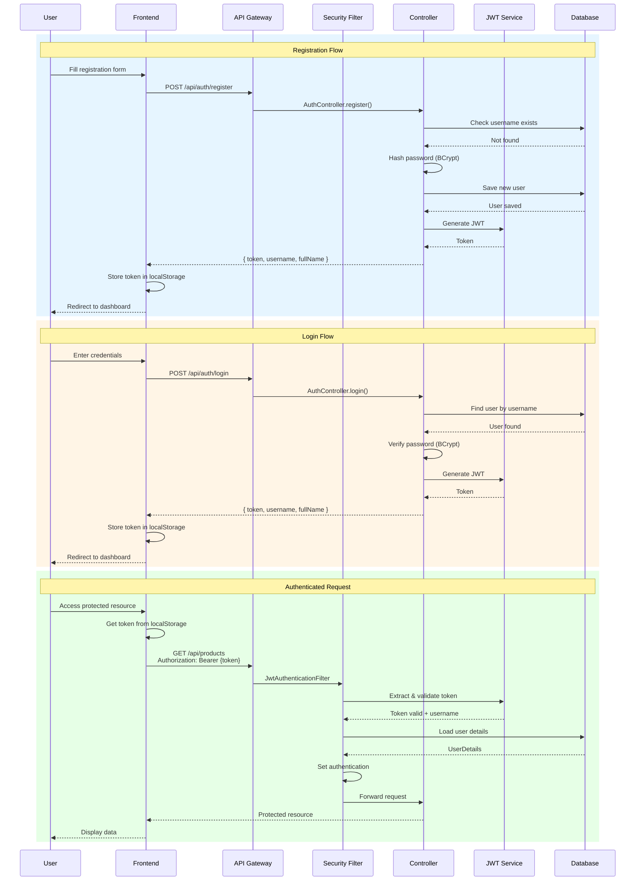
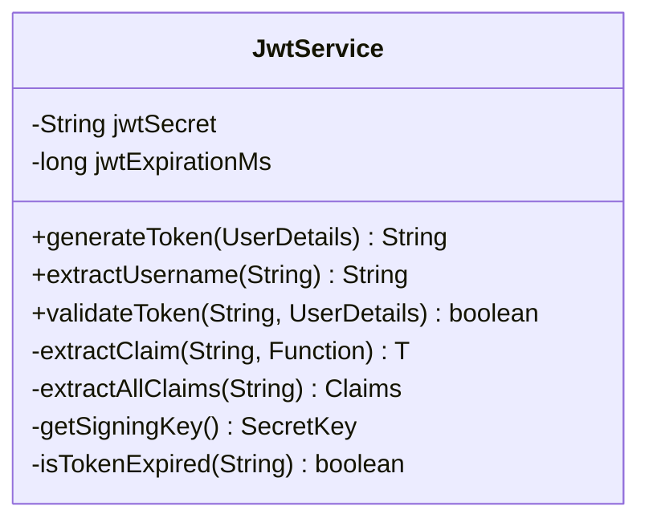
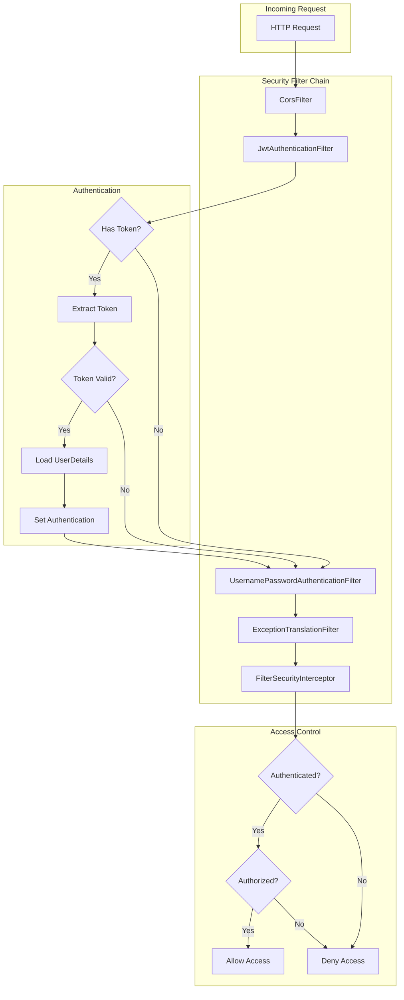

# 🔐 Security Documentation

> JWT Authentication and Authorization in WMS

## Overview

WMS implements **stateless JWT (JSON Web Token) authentication** using Spring Security 6. This provides:

- 🔑 Token-based authentication
- 🛡️ Stateless session management
- ⏱️ Configurable token expiration
- 🔒 BCrypt password hashing

---

## Authentication Flow



---

## Security Configuration

### Public Endpoints

These endpoints are accessible without authentication:

```java
.requestMatchers("/api/auth/**").permitAll()
.requestMatchers("/api/hello").permitAll()
```

| Endpoint | Method | Description |
|----------|--------|-------------|
| `/api/auth/register` | POST | User registration |
| `/api/auth/login` | POST | User login |
| `/api/hello` | GET | Health check |

### Protected Endpoints

All other endpoints require a valid JWT token:

```java
.anyRequest().authenticated()
```

---

## JWT Structure

### Token Format

```
eyJhbGciOiJIUzI1NiJ9.eyJzdWIiOiJhZG1pbiIsImlhdCI6MTcwOTEyMzQ1NiwiZXhwIjoxNzA5MjA5ODU2fQ.abc123...
```

### Token Payload (Claims)

```json
{
  "sub": "admin",           // Subject (username)
  "iat": 1709123456,        // Issued at (Unix timestamp)
  "exp": 1709209856         // Expiration (Unix timestamp)
}
```

### Token Lifetime

Default: **24 hours** (86,400,000 milliseconds)

```java
private long jwtExpirationMs = 86400000;
```

---

## Password Security

### Hashing Algorithm

Passwords are hashed using **BCrypt** with a strength factor of 10:

```java
@Bean
public PasswordEncoder passwordEncoder() {
    return new BCryptPasswordEncoder();
}
```

### Password Verification

```java
if (!passwordEncoder.matches(password, user.getPasswordHash())) {
    throw new RuntimeException("Invalid credentials");
}
```

---

## Security Components

### JwtService

Handles JWT operations:



| Method | Purpose |
|--------|---------|
| `generateToken()` | Creates new JWT for authenticated user |
| `extractUsername()` | Extracts username from token |
| `validateToken()` | Validates token signature and expiration |
| `isTokenExpired()` | Checks if token has expired |

### JwtAuthenticationFilter

Intercepts requests and validates tokens:

```java
@Override
protected void doFilterInternal(
    HttpServletRequest request,
    HttpServletResponse response,
    FilterChain filterChain
) {
    // 1. Extract token from Authorization header
    // 2. Validate token
    // 3. Set authentication in SecurityContext
    // 4. Continue filter chain
}
```

### CustomUserDetailsService

Loads user data from database:

```java
@Override
public UserDetails loadUserByUsername(String username) {
    User user = userRepository.findByUsername(username)
        .orElseThrow(() -> new UsernameNotFoundException(...));
    
    return org.springframework.security.core.userdetails.User
        .withUsername(user.getUsername())
        .password(user.getPasswordHash())
        .authorities("ROLE_USER")
        .build();
}
```

---

## Frontend Integration

### Storing Token

```typescript
// After successful login
localStorage.setItem('token', response.token);
localStorage.setItem('user', JSON.stringify({
    username: response.username,
    fullName: response.fullName
}));
```

### Sending Token

```typescript
// API client configuration
const api = axios.create({
    baseURL: '/api',
    headers: {
        'Content-Type': 'application/json'
    }
});

// Add token to requests
api.interceptors.request.use((config) => {
    const token = localStorage.getItem('token');
    if (token) {
        config.headers.Authorization = `Bearer ${token}`;
    }
    return config;
});
```

### Handling Token Expiration

```typescript
// Response interceptor
api.interceptors.response.use(
    (response) => response,
    (error) => {
        if (error.response?.status === 401) {
            localStorage.removeItem('token');
            window.location.href = '/login';
        }
        return Promise.reject(error);
    }
);
```

---

## CORS Configuration

Cross-Origin Resource Sharing (CORS) allows frontend to access the API:

```java
@Bean
CorsConfigurationSource corsConfigurationSource() {
    CorsConfiguration configuration = new CorsConfiguration();
    configuration.setAllowedOrigins(Arrays.asList(
        "http://localhost:5173",
        "http://127.0.0.1:5173"
    ));
    configuration.setAllowedMethods(Arrays.asList(
        "GET", "POST", "PUT", "PATCH", "DELETE", "OPTIONS"
    ));
    configuration.setAllowedHeaders(Arrays.asList("*"));
    configuration.setAllowCredentials(true);
    
    UrlBasedCorsConfigurationSource source = new UrlBasedCorsConfigurationSource();
    source.registerCorsConfiguration("/**", configuration);
    return source;
}
```

---

## Security Best Practices

### Implemented

| Practice | Implementation |
|----------|---------------|
| Password Hashing | BCrypt with strength 10 |
| Stateless Sessions | JWT tokens, no server-side sessions |
| Token Expiration | 24-hour token lifetime |
| CSRF Disabled | Not needed for stateless API |
| CORS Configured | Whitelist allowed origins |

### Recommendations for Production

| Enhancement | Description |
|-------------|-------------|
| HTTPS | Use TLS/SSL certificates |
| Token Refresh | Implement refresh token flow |
| Rate Limiting | Prevent brute force attacks |
| JWT Secret | Use strong, environment-specific secrets |
| Audit Logging | Log authentication events |
| Password Policy | Enforce minimum complexity |

---

## Error Responses

### 401 Unauthorized

```json
{
    "timestamp": "2024-01-15T10:30:00",
    "status": 401,
    "error": "Unauthorized",
    "message": "Full authentication is required"
}
```

### 403 Forbidden

```json
{
    "timestamp": "2024-01-15T10:30:00",
    "status": 403,
    "error": "Forbidden",
    "message": "Access Denied"
}
```

---

## Security Flow Diagram



---

[← Back to Documentation Index](./README.md)
